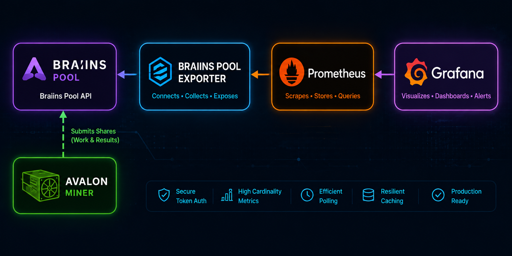

# Braiins Pool Exporter

<p align="center">
  
</p>

<p align="center">
  <a href="https://github.com/nicosmuts/braiins-pool-exporter/blob/main/go.mod"></a>
  <a href="LICENSE"></a>
  <a href="https://github.com/nicosmuts/braiins-pool-exporter/commits/main"></a>
  <a href="https://github.com/nicosmuts/braiins-pool-exporter/issues"></a>
</p>

<p align="center">
  
  
  
  
  
  
</p>

Braiins Pool Exporter is an independent Prometheus exporter for users of the
official Braiins Pool API. It polls verified Braiins Pool account, worker,
reward, and payout endpoints, normalizes the responses into stable Prometheus
metrics, and serves them from a small Go HTTP process. Prometheus scrapes the
exporter rather than the pool API directly, while the included Grafana
dashboard provides a reusable default view of the exported metrics.

Data flows from Avalon miners to Braiins Pool, then through Braiins Pool
Exporter into Prometheus and Grafana. The exporter keeps deployment-specific
scrape configuration, worker mappings, credentials, and production dashboards
outside the public repository.

## Project status

- Active development.
- Official API contract verified for the currently implemented collectors.
- Default Grafana dashboard available.
- Docker Compose development stack available.
- Stable releases are not yet published.
- Tag-gated container publishing and GitHub Releases are configured.

## Features

### Account metrics

- Account hashrate windows.
- Current account balance.
- Account worker counts by normalized state.
- Account freshness and last-success timestamps.

### Worker metrics

- Worker state as bounded one-hot gauges.
- Worker hashrate windows.
- Worker share windows.
- Worker last-share timestamp and age.
- Bounded worker label cardinality.

### Rewards and payouts

- Bounded reward aggregation by safe reward component.
- Bounded payout amount and fee aggregation by rail and status.
- Precision-safe BTC reward accounting.
- Integer satoshi payout accounting.
- No reward dates, payout destinations, or transaction identifiers as labels.

### Exporter

- Prometheus, Go runtime, process, build, and readiness metrics.
- `/metrics`, `/-/healthy`, `/-/ready`, and `/version` endpoints.
- Environment- or file-based token loading with redaction safeguards.
- Bounded polling, retries, backoff, rate-limit handling, and caching.
- Stale-but-visible last-known-good data.
- Graceful shutdown and offline unit tests.
- Production-oriented multi-stage Docker image.

### Grafana

- Importable default dashboard at
  [`grafana/braiins-pool-exporter.json`](grafana/braiins-pool-exporter.json).
- Stable dashboard UID `braiins-pool-exporter`.
- Prometheus datasource variable.
- Portable job, instance, and optional worker filters.
- Account, worker, rewards, payouts, API health, and freshness panels.

## Quick start

### Requirements

- Go 1.26.5.
- Docker with Docker Compose for the full local stack.
- GNU Make is optional.

### Clone

```sh
git clone https://github.com/nicosmuts/braiins-pool-exporter.git
cd braiins-pool-exporter
```

### Configure

```sh
cp .env.example .env
```

Edit `.env` and set either `BRAIINS_POOL_TOKEN` for development or
`BRAIINS_POOL_TOKEN_FILE=/run/secrets/braiins_pool_token` with a local token
file at `secrets/braiins_pool_token`.

Leaving both token settings blank is valid for token-free validation. In that
mode the exporter starts, Prometheus scrapes self-metrics, and Grafana imports
the dashboard without authenticated Braiins Pool data.

### Start the stack

```sh
docker compose up --build -d
```

Open:

- Exporter: <http://localhost:9108>
- Metrics: <http://localhost:9108/metrics>
- Prometheus: <http://localhost:9090>
- Grafana: <http://localhost:3000>

```sh
curl http://localhost:9108/-/healthy
curl http://localhost:9108/-/ready
docker compose ps
```

Grafana is provisioned automatically with the Prometheus datasource and the
`Braiins Pool Exporter` dashboard. For local development, anonymous admin
access is enabled in Compose.

### Stop the stack

```sh
docker compose down -v
```

### Run without Docker

```sh
go mod download
go build -o bin/braiins-pool-exporter ./cmd/braiins-pool-exporter
go run ./cmd/braiins-pool-exporter
```

The default listen address is `:9108`.

## Configuration

The exporter requires exactly one Braiins token source when API-derived metrics
are enabled.

### Required for Braiins API polling

| Setting | Default | Description |
|---|---:|---|
| `BRAIINS_POOL_TOKEN` | unset | Braiins API token value. |
| `BRAIINS_POOL_TOKEN_FILE` | unset | Path to a file containing the Braiins API token. |

Set only one of `BRAIINS_POOL_TOKEN` or `BRAIINS_POOL_TOKEN_FILE`. Token command
line flags are intentionally unsupported.

### Optional environment variables

| Setting | Default | Description |
|---|---:|---|
| `BRAIINS_POOL_COIN` | `btc` | Coin selector. Only `btc` is currently verified and accepted. |
| `BRAIINS_POOL_API_BASE_URL` | official API origin | Override for tests or compatible endpoints. |
| `BRAIINS_POOL_POLL_INTERVAL` | `1m` | Poll interval. |
| `BRAIINS_POOL_TIMEOUT` | `10s` | Per-request HTTP timeout. |
| `BRAIINS_POOL_WORKER_METRICS_ENABLED` | `true` | Enable worker metrics when a token is configured. |
| `BRAIINS_POOL_MAX_WORKERS` | `100` | Maximum accepted workers per snapshot. |
| `BRAIINS_POOL_REWARDS_ENABLED` | `true` | Enable bounded rewards metrics. |
| `BRAIINS_POOL_PAYOUTS_ENABLED` | `true` | Enable bounded payout metrics. |
| `BRAIINS_POOL_HISTORY_DAYS` | `7` | Inclusive rewards and payouts history window, capped at 90 days. |

### Command-line flags

| Flag | Default | Description |
|---|---:|---|
| `--web.listen-address` | `:9108` | HTTP listen address. |
| `--web.telemetry-path` | `/metrics` | Metrics path. |
| `--log.level` | `info` | Log level: `debug`, `info`, `warn`, or `error`. |
| `--log.format` | `text` | Log format: `text` or `json`. |
| `--config.file` | empty | Reserved until a safe configuration format is defined. |

Worker labels use Braiins API worker names. Treat the exporter HTTP interface
as private operational telemetry if worker names reveal internal conventions.

## Containers and releases

The production image is built from [`Dockerfile`](Dockerfile). It uses a
multi-stage Go build with `CGO_ENABLED=0`, `-buildvcs=false`, a static binary,
OCI labels, and a distroless non-root runtime image without a shell or package
manager. Health is exposed through `/-/healthy` and `/-/ready` and validated by
orchestrators or external probes.

The local development stack in [`compose.yaml`](compose.yaml) starts exactly
three services:

- `braiins-pool-exporter`
- `prometheus`
- `grafana`

Prometheus uses [`prometheus/prometheus.yml`](prometheus/prometheus.yml) to
scrape the exporter over the Compose network. Grafana provisions the
Prometheus datasource and dashboard from `grafana/provisioning/`.

Release publishing is tag-gated. Ordinary pushes and pull requests run
validation and Docker build checks but do not publish images. Tags matching
`v*.*.*` build and publish multi-architecture images to:

```text
ghcr.io/nicosmuts/braiins-pool-exporter
```

The release workflow publishes semantic-version tags and `latest`, attaches
OCI metadata, and creates a GitHub Release. Do not create release tags until
the release contents are reviewed.

## Metrics

Metric names, labels, units, and behavior are documented in
[`docs/METRICS.md`](docs/METRICS.md). The dashboard and tests use that metric
contract as the source of truth.

## Documentation

- [API discovery](docs/API_DISCOVERY.md)
- [Metrics](docs/METRICS.md)
- [Architecture](docs/ARCHITECTURE.md)
- [Security design](docs/SECURITY.md)
- [Development](docs/DEVELOPMENT.md)
- [Configuration](docs/CONFIGURATION.md)
- [Release process](docs/RELEASE.md)
- [Grafana dashboard](grafana/README.md)
- [Contributing](CONTRIBUTING.md)

## Roadmap

Completed:

- API verification.
- Account metrics.
- Worker metrics.
- Rewards and payouts.
- Exporter hardening.
- Default Grafana dashboard.
- Docker image.
- Docker Compose development stack.
- Release automation.

Planned:

- First stable release.

## Contributing

Contributions are welcome. Please read [`CONTRIBUTING.md`](CONTRIBUTING.md)
before opening issues or pull requests.

## Security

Never provide a wallet private key or seed phrase to this exporter. Report
vulnerabilities according to [`SECURITY.md`](SECURITY.md).

## License

Licensed under the [Apache License 2.0](LICENSE).

Braiins is a trademark of its respective owner. This independent project is
not affiliated with or endorsed by Braiins.
